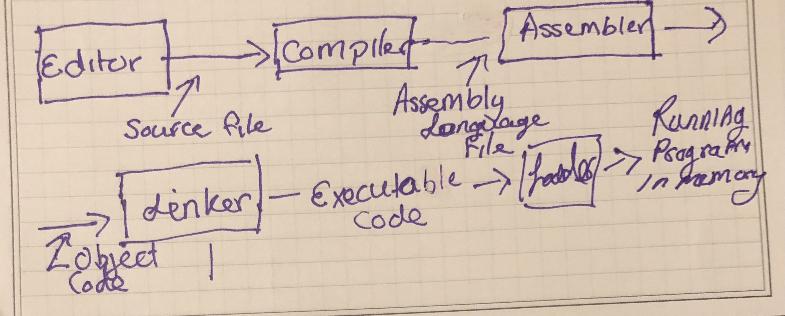
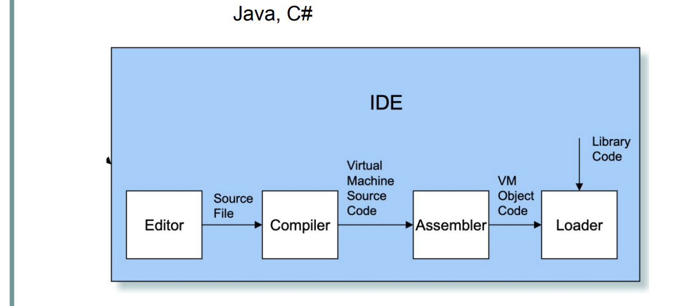
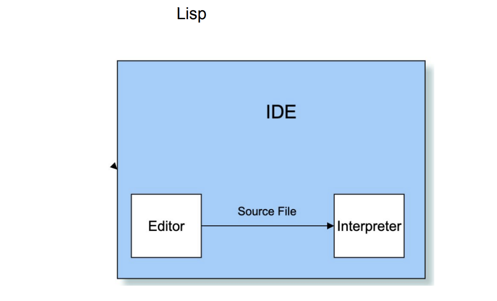
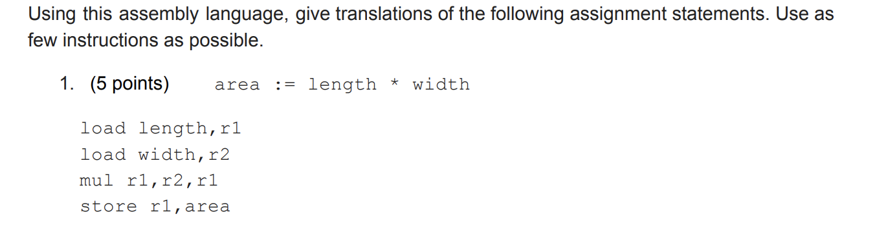
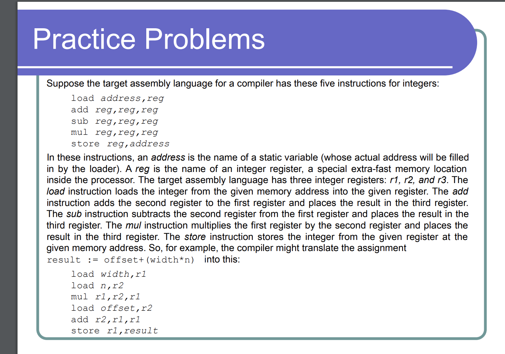

# Week-3 Language Systems & ML- by Jimmy Zhang
## Language Systems
What is happening in an ide( Integrated Development Environment )?
- Well each group of language display it differently
  - for classical sequence -> C++,C,Fortran
  ide for classical sequence 
  
  
  Another group of language like Java, C# display this
  **Quick note: Java and C# does not have a linker because the program is linked at run time.**
  
  
  As for lisp it display it like this 
  
  
## Part of some IDE
**Compiler** and **Interpreters**
- Compilers takes an entire program language and convert them to low level language like binary code.
- Interpreters directly excutes the high level language.
- **Note: virtual machines can be consider as an interpreter for low level languages as they firectly executes them without first translating them.**
compiler can generate efficient code and run faster thaan interpreted programs
example facebook having to make hhvm.

we have to translate some lanuages to **assembly language**
what is assembly language?
- assembly language is a type of low level programming language that is intended to communicate directly with a computer's hardware.
- design to be readable by use human.
- **Practice example:**

## Assembly language 
let us use address = (1*2)+3
the assembly lanuage will display it like this 
load 1,r1
load 2,r2
mul r1,r2,r1
load 3,r2
add r1,r2,r1
store r1, address
more example to get the least of amount of instruction. 

## ML or SML( standard ML)
the ML environment runs in an interactive mode 
ML- Constant Express
- The simplest in the Ml language is a constant expression
### Getting Started
**Keep in mind:so there something are similar that can be applied to this lanuage**
val it = 1234.0:real
the real is the type while 1234.0 is the value for the variable. it is the name of the variable.
**using if-then-else or if-then statement**
- if a>b then a else b 

**Need to comment**
(* hello *) -> (**)

**Example of List**
list is a tuple that where all elements are the same type.
- 1::nil;
val it = [1] : int list
- val l = [1,2,3];
val l = [1,2,3] : int list
special list : the empty list [] or nil

**Example of tuples**
-val joe = (30,150,single,HR)
-tuples records the value that describe a particular object.

**NULL:** test if a list is empty
null([]);
-val it = true:bool

**@:** concatenates two list
[1,2]@[4,5]
val it = [1,2,4,5]:int list
**::** cons operator
1::2::3::[]
var it = [1,2,3]:int list

**hd:** using head operator return the first element of the list
**tl:** tail operator return the whole list without the first element
- hd l;
val it = 1 : int
- tl l;
val it = [2,3] : int list
- tl(tl(tl l));
val it = [] : int list

**Function:** are defined “explicitly” using a fun declaration
fun < fun_name> < parameter> = < expression>;

For example:
- fun double x = 2*x;
- fun inc x = x+1;
- fun adda s = s ^ "a";

These functions may be entered as above. To execute a function simply give the function name followed by the actual argument. For example:

-double 6;
-inc 100;
-adda "cub";
 go to sosml - https://sosml.org/ to practice 
 
#resource and practice
- “COS 441: Home Page.” Princeton University, The Trustees of Princeton University, https://www.cs.princeton.edu/courses/archive/fall08/cos441/. 
- i4ki. “I4KI/Awesome-SML: Useful Things for Standard ML.” GitHub, https://github.com/i4ki/awesome-sml. 

# Reference
- https://brightspace.uri.edu/content/enforced/188472-2226_200753_3000_0000_SS3/CSC301_slides/Week%203%20LV1%20-%20Language%20Systems.pdf?_&d2lSessionVal=Nfw0uGnClvfW1dUl2tZwhWqKa&ou=188472
- Webber, Adam. Modern Programming Languages: A Practical Introduction. Franklin, Beedle &amp; Associates, 2002. 
- https://brightspace.uri.edu/content/enforced/188472-2226_200753_3000_0000_SS3/CSC301_slides/Week%204%20LV1%20-%20A%20First%20Look%20at%20ML.pdf?_&d2lSessionVal=Nfw0uGnClvfW1dUl2tZwhWqKa&ou=188472

